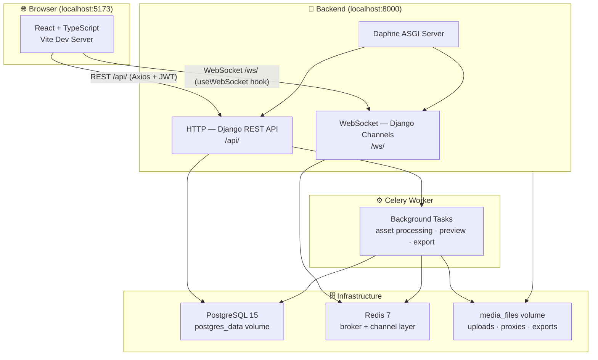
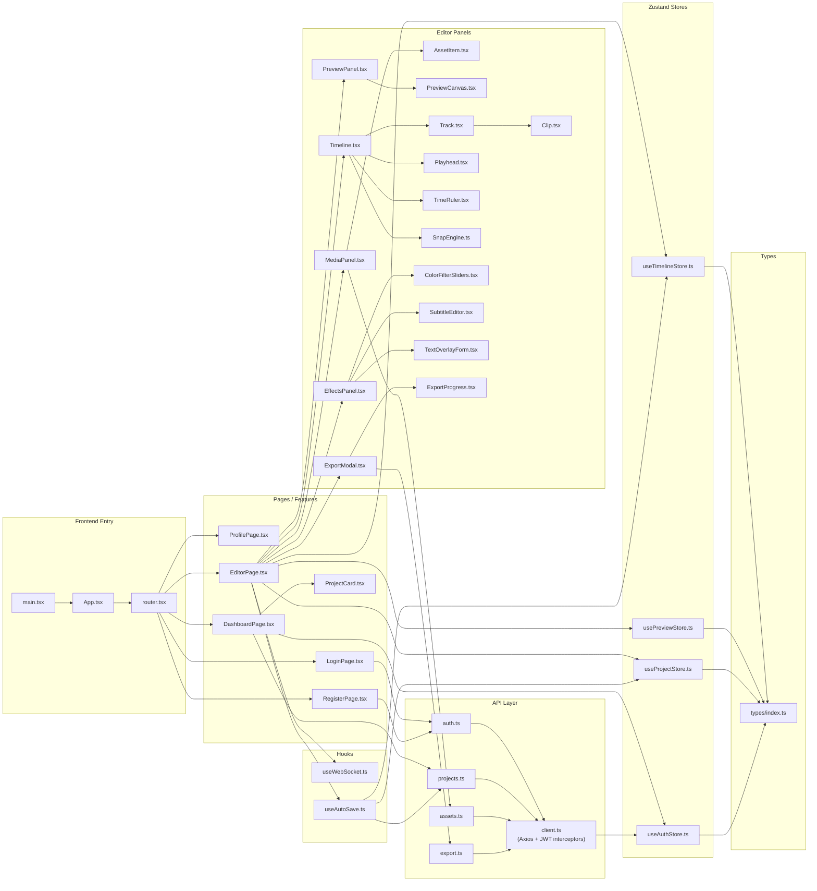
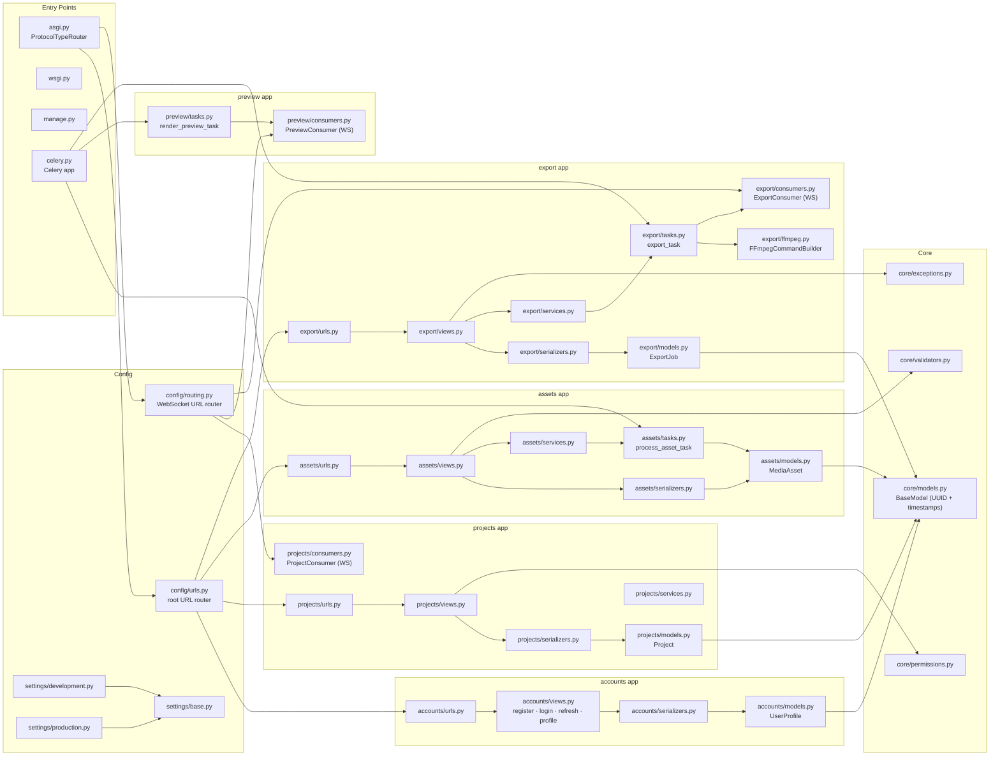
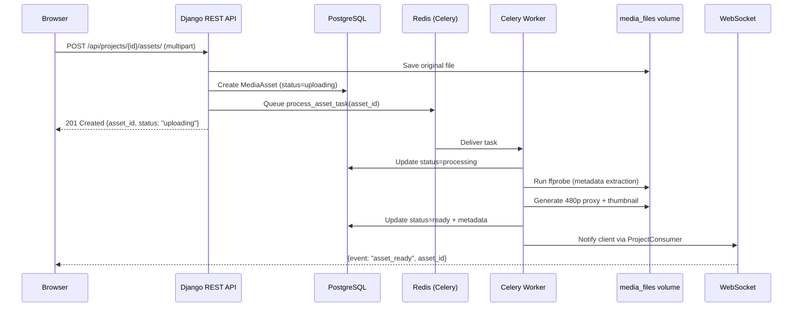
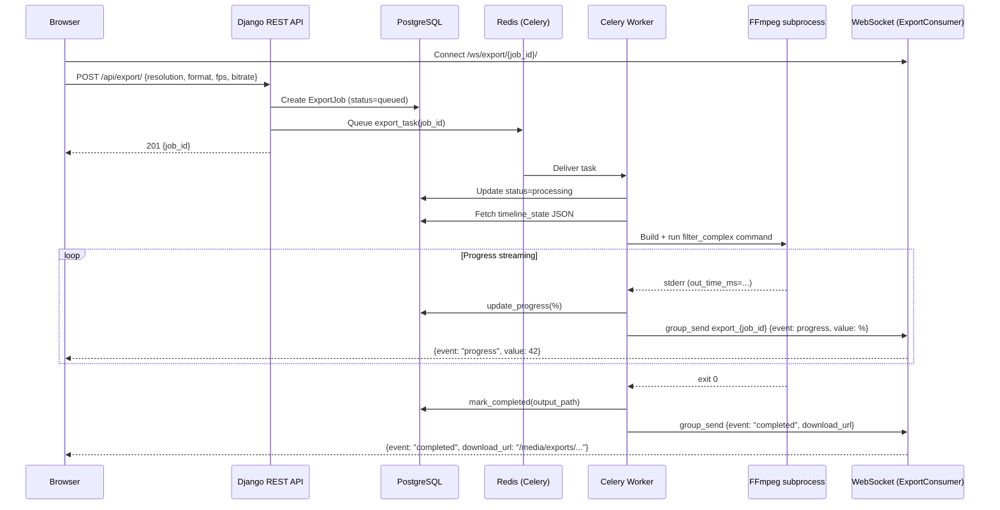
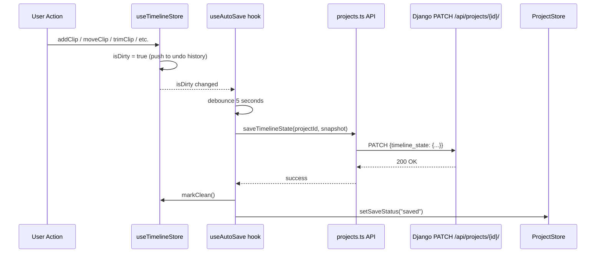
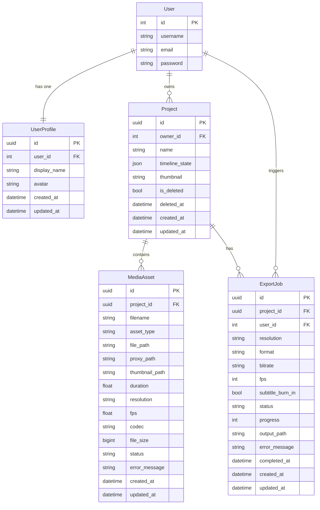

# Auracut

A browser-based, zero-cost multi-track video editor built with **Django + React**.  
Full NLE (non-linear editor) that runs entirely in the browser — multi-track timeline, real-time hybrid preview, server-side FFmpeg export, and live progress streaming over WebSockets.

---

## Tech Stack

| Layer | Technology |
|---|---|
| Frontend | React 19, TypeScript, Vite 8, Zustand, Axios, dnd-kit, Fabric.js |
| Backend | Django 4.2, Django REST Framework, Daphne (ASGI) |
| Real-time | Django Channels 4, Redis 7 (channel layer) |
| Task Queue | Celery 5, Redis 7 (broker) |
| Database | PostgreSQL 15 |
| Video Processing | FFmpeg (bundled in container), MoviePy, Pillow |
| Auth | JWT via `djangorestframework-simplejwt` |
| Infrastructure | Docker, Docker Compose |

---

## Architecture Overview



---

## Full File Connection Map



---

## Backend File Connection Map



---

## Data Flow Diagrams

### Asset Upload Flow



### Export Flow



### Auto-Save Flow



---

## Database Schema



---

## WebSocket Channels

| Path | Consumer | Purpose |
|---|---|---|
| `/ws/project/{project_id}/` | `ProjectConsumer` | Real-time project state sync, asset ready notifications |
| `/ws/preview/{project_id}/` | `PreviewConsumer` | Single-frame preview render results |
| `/ws/export/{job_id}/` | `ExportConsumer` | Export progress (0–100%) and completion/failure events |

---

## REST API Endpoints

| Method | Path | Description |
|---|---|---|
| `POST` | `/api/auth/register/` | Create account |
| `POST` | `/api/auth/login/` | Obtain JWT pair |
| `POST` | `/api/auth/refresh/` | Refresh access token |
| `GET/PATCH` | `/api/auth/profile/` | Get or update user profile |
| `GET/POST` | `/api/projects/` | List or create projects |
| `GET/PATCH/DELETE` | `/api/projects/{id}/` | Retrieve, update, or soft-delete a project |
| `GET/POST` | `/api/projects/{id}/assets/` | List or upload assets for a project |
| `GET/DELETE` | `/api/assets/{id}/` | Retrieve or delete an asset |
| `GET/POST` | `/api/export/` | List or create export jobs |
| `GET` | `/api/export/{id}/` | Get export job status |

---

## Project Structure

```
auracut/
├── backend/
│   ├── apps/
│   │   ├── accounts/       # User auth + profile (JWT)
│   │   ├── assets/         # Media upload, ffprobe, proxy generation
│   │   ├── export/         # FFmpeg export pipeline + WebSocket progress
│   │   ├── preview/        # Single-frame preview rendering
│   │   └── projects/       # Project CRUD + timeline state storage
│   ├── config/
│   │   ├── settings/       # base / development / production
│   │   ├── asgi.py         # Daphne entry point (HTTP + WS)
│   │   ├── celery.py       # Celery app config
│   │   ├── routing.py      # WebSocket URL patterns
│   │   └── urls.py         # Root HTTP URL patterns
│   ├── core/
│   │   ├── models.py       # BaseModel (UUID pk, created_at, updated_at)
│   │   ├── permissions.py  # IsOwner permission class
│   │   ├── validators.py   # File type + size validators
│   │   └── exceptions.py   # Custom DRF exception handler
│   ├── Dockerfile
│   ├── entrypoint.sh       # wait-for-db → migrate → collectstatic → daphne
│   └── requirements.txt
├── frontend/
│   └── src/src/
│       ├── api/            # Axios client + typed API functions per domain
│       ├── components/     # Button, Modal, ProgressBar, Spinner, Toast
│       ├── features/
│       │   ├── auth/       # LoginPage, RegisterPage, ProfilePage
│       │   ├── dashboard/  # DashboardPage, ProjectCard
│       │   └── editor/     # EditorPage + all sub-panels
│       │       ├── EffectsPanel/   # Color filters, subtitles, text overlays
│       │       ├── ExportModal/    # Export settings + progress display
│       │       ├── MediaPanel/     # Asset browser + upload
│       │       ├── PreviewPanel/   # Fabric.js canvas preview
│       │       └── Timeline/       # Multi-track timeline, clips, snap engine
│       ├── hooks/
│       │   ├── useAutoSave.ts      # Debounced 5s auto-save to backend
│       │   └── useWebSocket.ts     # Reconnecting WebSocket with exp. backoff
│       ├── store/
│       │   ├── useAuthStore.ts     # JWT tokens + user state
│       │   ├── usePreviewStore.ts  # Preview frame state
│       │   ├── useProjectStore.ts  # Active project + save status
│       │   └── useTimelineStore.ts # Full NLE state + undo/redo (50 steps)
│       ├── types/index.ts          # All shared TypeScript interfaces
│       └── router.tsx              # React Router v7 route definitions
├── .env.example
└── docker-compose.yml
```

---

## Prerequisites

| Requirement | Version |
|---|---|
| Docker | 24+ |
| Docker Compose | v2+ |
| FFmpeg | bundled inside backend container — not needed on host |

---

## Quick Start

```bash
# 1. Clone
git clone <repo-url>
cd auracut

# 2. Configure environment
cp .env.example .env
# Edit .env — set a strong SECRET_KEY at minimum

# 3. Start all services
docker compose up --build
```

| URL | Service |
|---|---|
| http://localhost:5173 | Frontend (Vite dev server) |
| http://localhost:8000 | Backend API (Daphne ASGI) |

```bash
# Stop (keep data)
docker compose down

# Stop + wipe all data
docker compose down -v
```

---

## Environment Variables

| Variable | Description |
|---|---|
| `SECRET_KEY` | Django secret key — **change before any deployment** |
| `DB_NAME` / `DB_USER` / `DB_PASSWORD` | PostgreSQL credentials |
| `REDIS_URL` | Redis broker URL (default: `redis://redis:6379`) |
| `MEDIA_ROOT` | Absolute path for uploaded media inside the container |
| `MAX_UPLOAD_SIZE` | Max file upload size in bytes (default: 2 GB) |
| `BACKEND_PORT` | Host port for the backend (default: `8000`) |
| `FRONTEND_PORT` | Host port for the frontend (default: `5173`) |

---

## Key Design Decisions

- **Timeline as JSON** — `Project.timeline_state` stores the full NLE state as a single `JSONField`. Avoids over-normalizing a deeply nested, frequently mutated structure and enables instant undo/redo snapshots on the client.
- **Proxy-first preview** — uploaded videos are transcoded to 480p proxies by the Celery worker. The editor always uses proxies for smooth playback; the original file is only used during final export.
- **Undo/redo on the client** — `useTimelineStore` maintains a 50-step history stack entirely in memory. No round-trips to the server for undo/redo.
- **Auto-save with debounce** — `useAutoSave` waits 5 seconds after the last change before persisting to the backend, with 3 automatic retries on failure.
- **WebSocket reconnection** — `useWebSocket` implements exponential backoff (up to 5 attempts) before surfacing a toast error to the user.
- **Soft deletes** — projects are never hard-deleted; `is_deleted` + `deleted_at` flags allow future recovery.
